# マップ別のイニシエーター定点まとめ
マップ毎のイニシエーター数の定石と、イニシエーター毎のピック率(VCT2023 Champions)を記載。

## スプリット

### イニシエーター
- イニシエーター: 1
    - スカイ: 68%
    - ブリーチ: 22%

### 定点
基本出すイニシエーターがスカイのため、定点なし

## ヘイヴン

### イニシエーター
- イニシエーター: 2
    - ブリーチ: 58%
    - ソーヴァ: 46%
        - キルジョイウルトに対抗できるソーヴァウルト
    - スカイ: 38%

 

### ソーヴァ定点
#### アタッカー
##### Aロング

- やり方
    - しゃがみ
    - 0バウンス
    - 2チャージ
- 補足
    - レンガ裏の張り付きも映る

##### Aサイト

- やり方
    - ジャンプ
    - 0バウンス
    - 2チャージ
- 補足
    - Aショート側のAサイト手前も映る
    - CT側のアンダーは映らないので注意

##### Bサイト

適当にコンテナ奥に刺す

##### Cガレージ

- やり方
    - 0バウンス
    - フルチャージ
- 補足
    - Cウィンドウは映らない
    - Cウィンドウから壊されない

##### Cサイト

- やり方
    - しゃがみ
    - 1バウンス
    - フルチャージ

#### ディフェンダー
##### Aロング1

- やり方
    - 1バウンス
    - フルチャージ

##### Aロング2

- やり方
    - しゃがみ
    - 2バウンス
    - フルチャージ

##### Cロング
適当にぶち込む

## バインド
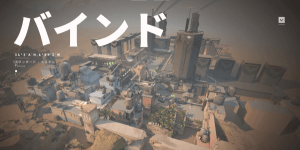

### イニシエーター
- イニシエーター: 1
    - スカイ: 73%
    - ゲッコー: 5.26%
        - ウィングマンによる設置・解除が強い
    - フェイド: 5.26%

### フェイド定点
#### アタッカー
##### AショートからAサイト

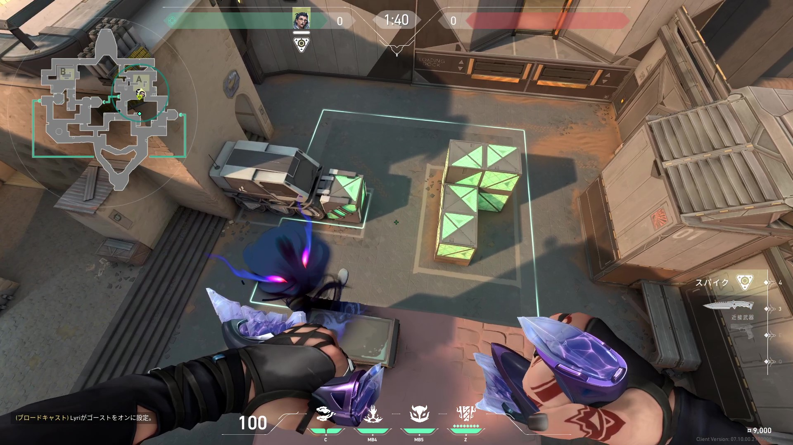

##### AシャワーからAサイト

- やり方
    - 走りジャンプ投げ

##### Bウィンドウ

- やり方
    - ジャンプ投げ
- 備考
    - 箱裏は映らないので注意

##### Bサイト1

- やり方
    - 走りジャンプ投げ
- 備考
    - ザリガニとサイト中が映る
    - UIが木の棒の下くらいになるまで走って投げる

##### Bサイト2

- 備考
    - Bウィンドウにモク炊かれててコンテナ上への乗せ方がわからないとき用

#### ディフェンダー
##### Aショート1

- やり方
    - ジャンプ投げ

##### Aショート2

- やり方
    - 走りジャンプ投げ

##### Aショート3

- やり方
    - ジャンプ投げ
- 備考
    - Aランプから投げられる
    - 壁張り付きは映らない

##### Aシャワー1

- やり方
    - 走りジャンプ投げ

##### Bショート

## アセント

### イニシエーター
- イニシエーター: 2
    - KAY/O: 69%
        - 通路が狭く、ナイフで検知しやすい
        - キルジョイウルトを定点グレで破壊できる
    - ソーヴァ: 63%
        - ドローンが強い
            - Aサイトの黒コン
            - Bサイト中全部見れる
    - フェイド: 6.25%
        - 2デュエでラッシュする構成なら良いかも？

 

### ソーヴァ定点
#### アタッカー
##### Aロング
- やり方
    - 1バウンス
    - フルチャージ
- 備考
    - 適当にAロングに入れるだけ

##### Aメイン1

- やり方
    - 0バウンス
    - フルチャージ
- 備考
    - 右張り付き, ツリー中, ヘブンは映らない

##### Aメイン2

- やり方
    - 0バウンス
    - 1チャージ
- 備考
    - ヘブンからのピークが映る
    - 黒コン裏が映らない

##### Aメイン3

- やり方
    - 0バウンス
    - 2チャージ
- 備考
    - 黒コン裏が映る
    - ヘブンが映らない

##### Bメイン1
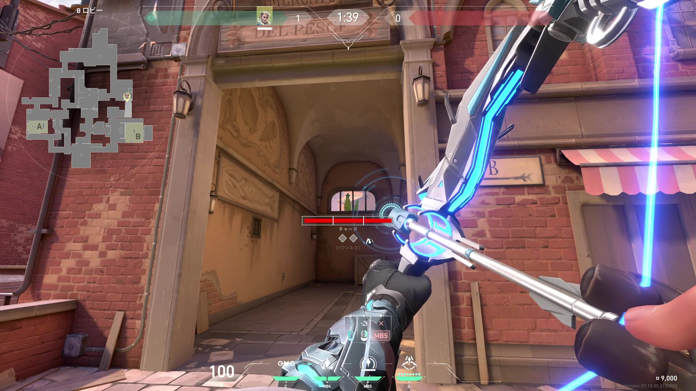

- やり方
    - 0バウンス
    - フルチャージ
- 備考
    - アッパーの張り付き、ボート中が映らない
##### Bメイン2

- やり方
    - 0バウンス
    - フルチャージ
- 備考
    - アッパーの張り付きが映る
    - 相手にオーディンがいる時に使う
#### ディフェンダー
##### Bロビー

- やり方
    - ジャンプ
    - 0バウンス
    - 1チャージ
- 備考
    - 箱裏の角は映らない

### KAY/O定点
#### アタッカー
##### Aサイト
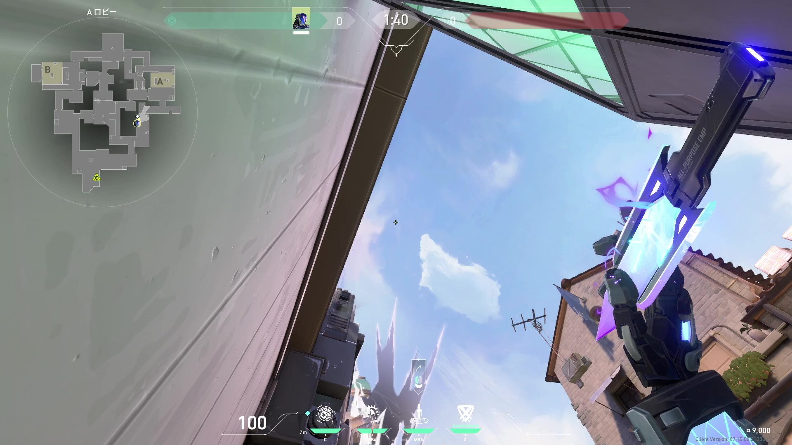

- 備考
    - Aサイト手前の張り付きは検知できない

##### Bサイト

#### ディフェンダー
##### Aメイン1

- やり方
    - ジャンプ

##### Aメイン2

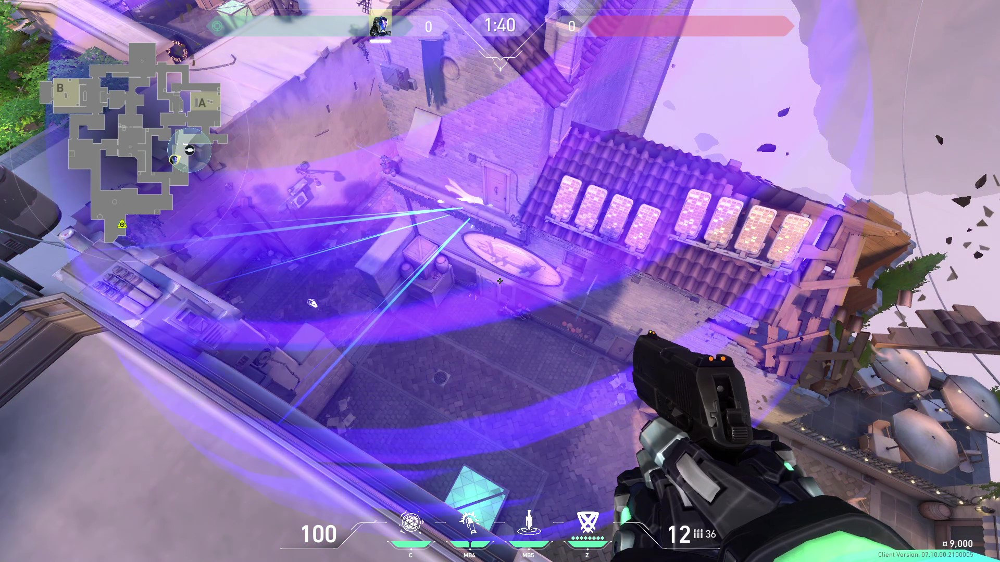

##### AからBメイン

- 備考
    - Aメインを守っていて、B側で敵が来ていると報告が来たとき
    - Aメインを守っていて、反応がないとき
    - 相手の準備を止める
    - 絶対に壊せない

##### Bメイン
適当にぶち込む

##### BからAメイン

- 備考
    - Bメインを守っていて、A側で敵が来ていると報告が来たとき
    - Bメインを守っていて、反応がないとき
    - 相手の準備を止める
    - 絶対に壊せない

## ロータス

### イニシエーター
- イニシエーター: 1
    - フェイド: 43%
    - スカイ: 25%

### フェイド定点
#### アタッカー
##### Aメイン

- やり方
    - ジャンプ投げ

##### Aサイト1

- やり方
    - 走りジャンプ投げ
    - 結構走る

##### Aサイト2

- やり方
    - ジャンプ投げ

##### Cメイン

- やり方
    - ジャンプ投げ

##### Cサイト

#### ディフェンダー
##### Aメイン1

- やり方
    - ジャンプ投げ

##### Aメイン2

- やり方
    - 歩きジャンプ投げ
    - 歩きは一瞬で、歩き, ジャンプ, 投擲はほぼ同時

##### Aメイン3

- やり方
    - 走りジャンプ投げ
    - 左壁の厚さ分くらい走る

##### Bサイト

- 備考
    - Bサイトリテイクのホウント

##### Cメイン1

- やり方
    - ジャンプ投げ

##### Cメイン2

- やり方
    - ジャンプ投げ

## ブリーズ

### イニシエーター
- イニシエーター: 2
    - ソーヴァ: 100%
    - KAY/O: 63%
    - スカイ: 27%

 

### ソーヴァ定点
#### アタッカー
##### Aサイト1

- やり方
    - 0バウンス
    - 2チャージ
- 備考
    - カニ裏が映る

##### Aサイト2

- やり方
    - 0バウンス
    - 2チャージ
- 備考
    - 奥、箱裏、階段が映る

##### Bサイト1

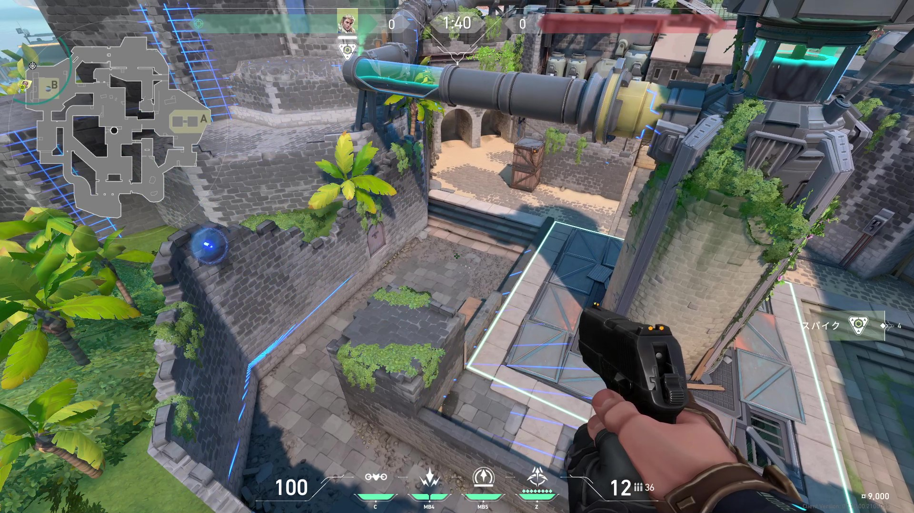
- やり方
    - 1バウンス
    - フルチャージ
- 備考
    - 奥、Bバックが映る
    - ミッドにいる敵にB侵攻がバレる
    - ドローンと合わせられる

##### Bサイト2

- やり方
    - 2バウンス
    - フルチャージ
- 備考
    - Bバックが映る

#### ディフェンダー
##### Aロビー

- 0バウンス
- 1チャージ

##### 開幕B 中央キャノン

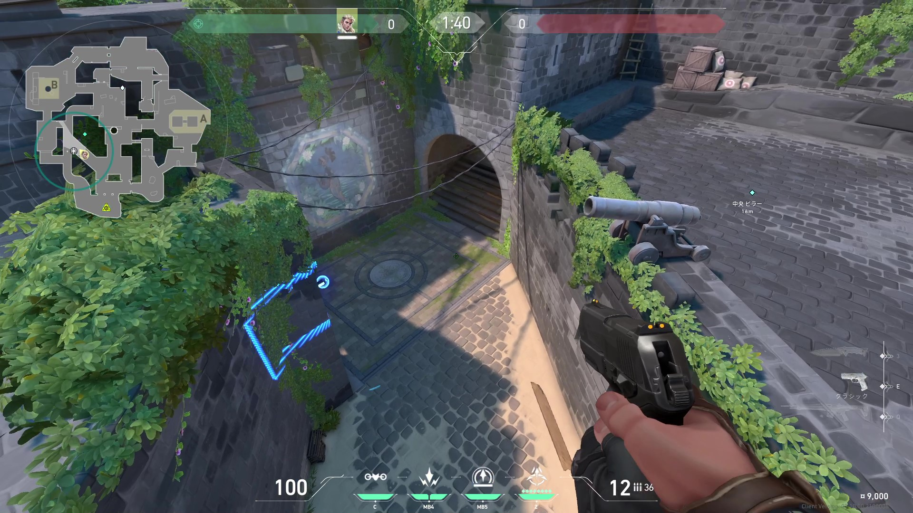
- 0バウンス
- 1チャージ

### KAY/O定点
#### アタッカー
##### Aサイト

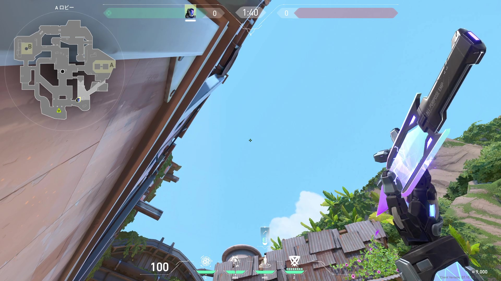

- 備考
    - ピラミッド周り全部映る

##### Aスイッチ

- 備考
    - Aスイッチ, 中央ウッドドアが映る

##### Bサイト1

- 備考
    - Bバック奥が映る

##### Bサイト2

- 備考
    - Bトンネル, Bウォール裏が映る

#### ディフェンダー
##### Aショップ

##### Aロビー

##### AサイトからBロビー

- やり方
    - しゃがみ

##### AサイトからBメイン

##### Bロビー1

- 備考
    - Bサイトから投げる

##### Bロビー2

- 備考
    - Bウォール裏から投げる

##### Bロビー3

- 備考
    - Bサイト奥のBバックから投げる

##### BトンネルからAショップ

## サンセット

### イニシエーター
- イニシエーター: 1
    - スカイ
        - 索敵能力が高く万能型なのでイニシエーター枠で迷ったらスカイ
    - フェイド
        - 索敵能力が高く、プラウラーが２つあるので中間エリアも取りやすい
        - 攻めでミッドやマーケットが大事なので、ミッドが取りやすいのが強い

### フェイド定点
#### アタッカー
##### Aサイト1

##### Aサイト2

- やり方
    - ジャンプ投げ

##### Aサイト3

- やり方
    - 走りジャンプ投げ
    - 走りは1歩くらい

##### AエルボーからAサイト

##### 中央ボトムからMID1

##### 中央ボトムからMID2

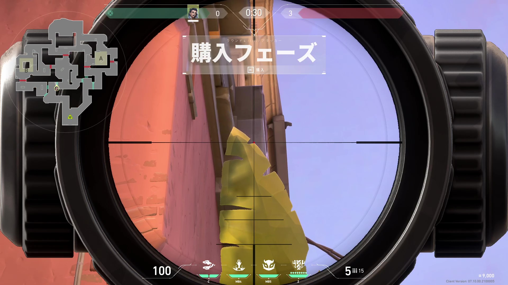

- やり方
    - ジャンプ投げ

##### 中央タイルからMID

- やり方
    - ジャンプ投げ

##### Bサイト1

- 備考
    - Bサイト入口にモクが炊かれててホウントどこに投げればいいかわかりづらいとき用
    - マップから角にピンを指して、UIをピンに合わせる

##### BマーケットからBサイト1

##### BマーケットからBサイト2

#### ディフェンダー
##### Aロビー1

- やり方
    - 走りジャンプ投げ
    - 結構走る
    - 走りが浅いとタイルに落ちることがあるので注意
- 備考
    - 中央タイルも映る

##### Aロビー2

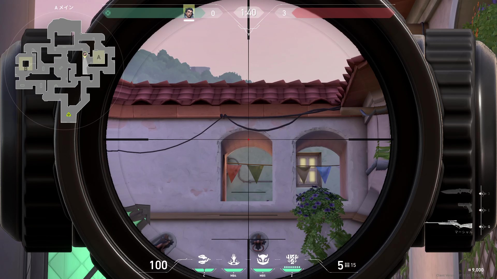
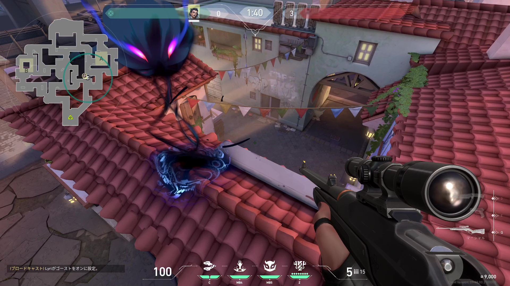
- やり方
    - ジャンプ投げ

##### AエルボーからAロビー

- やり方
    - 走りジャンプ投げ
    - 結構走る

##### MID

- やり方
    - ジャンプ投げ
- 備考
    - 中央タイルも映る